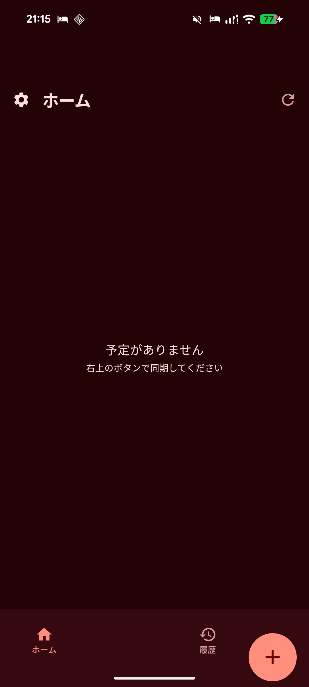
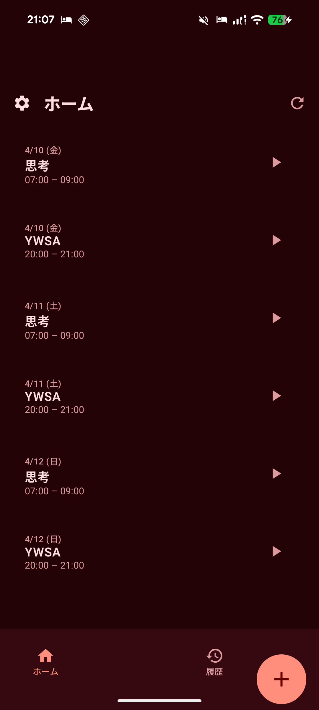
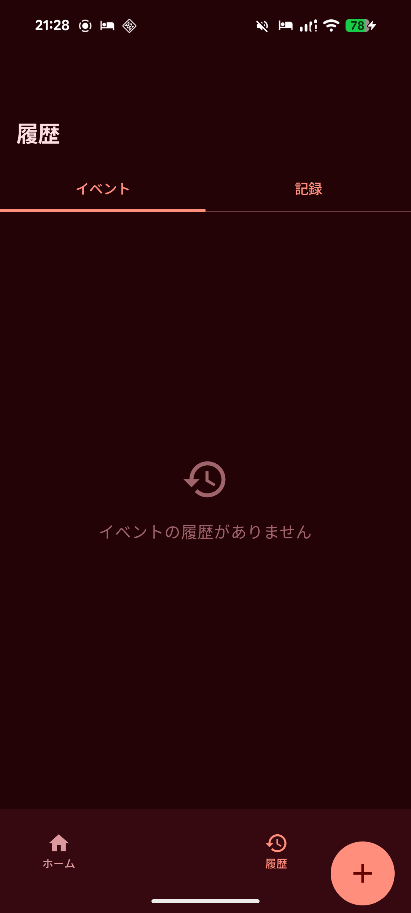
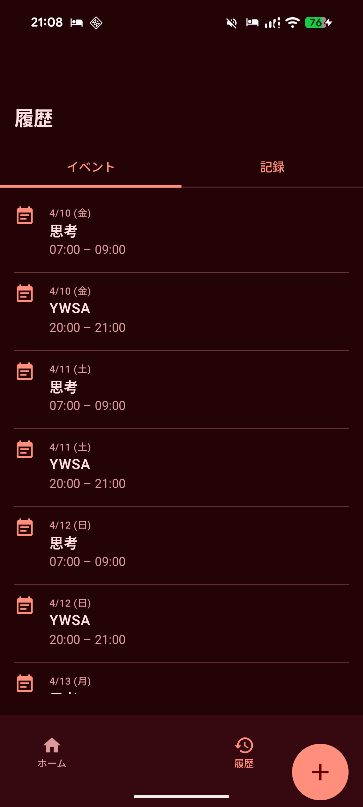
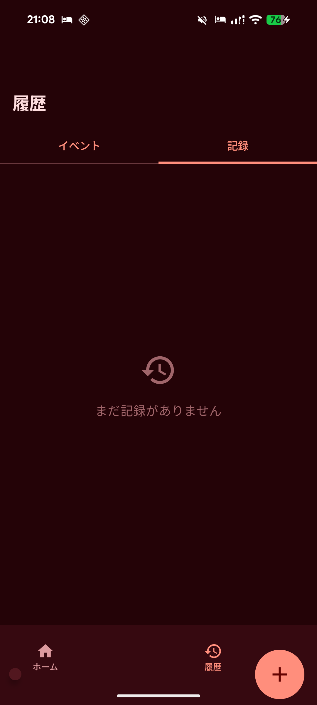
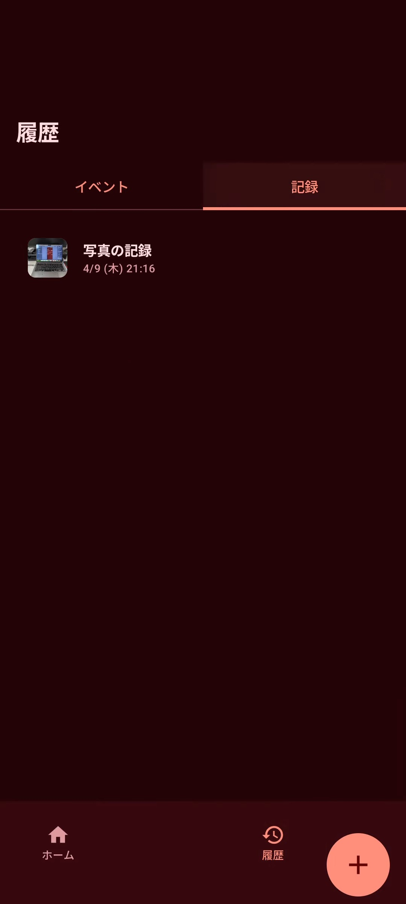
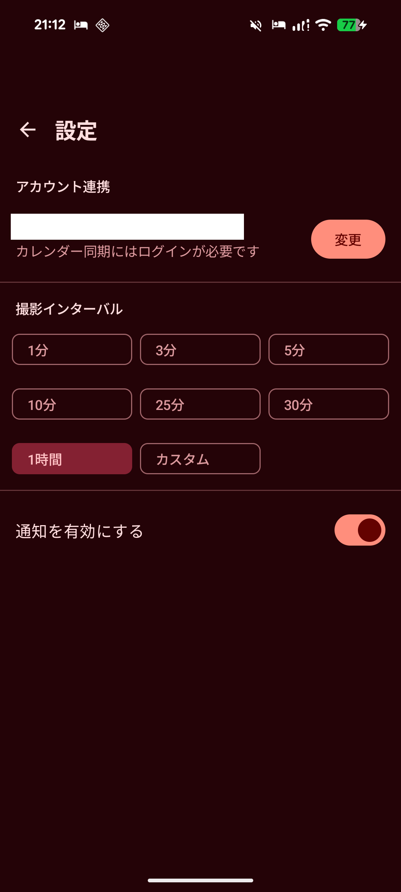

# AleartMyController

Google Calendar の予定に対して、実際の行動ログ（写真・テキストメモ・音声メモ）を記録し、振り返りを支援する Android アプリです。  
Toggl Track 連携により、記録操作に合わせて時間エントリを作成できます。  

## 概要

- 予定データ: Google Calendar から取得
- 記録データ: 端末ローカル（Room/SQLite）に保存
- 記録種別: 写真、テキストメモ、音声メモ
- 通知: WorkManager による定期リマインダー
- 設定: DataStore で撮影インターバル・通知設定を保持

## 主な機能

1. イベント一覧表示と同期
- Google Calendar の予定を取得し、イベント一覧に表示
- イベントごとの写真/メモ記録数を表示

2. イベント詳細と記録閲覧
- イベントに紐づく記録を確認
- 記録詳細で写真・メモ内容を表示

3. 記録追加
- 写真撮影/選択による記録追加
- テキストメモ追加
- 音声入力（Speech-to-Text）によるメモ追加


4. Toggl 連携
- 記録追加時に Toggl の時間エントリ作成を試行

5. リマインダー通知
- 15 分周期の Worker が進行中イベントを判定
- 該当時に「観察記録」通知を表示

6. 設定画面
- 撮影インターバルのプリセット/カスタム設定
- 通知 ON/OFF
- Google アカウント連携（サインイン）

## 画面構成

- ホーム（イベント一覧）
- 履歴
- 設定
- イベント詳細
- 記録追加
- 記録ダッシュボード
- 記録詳細

## アーキテクチャ

MVVM + Repository + DI（Hilt）をベースにした構成です。

- UI
  - Jetpack Compose
  - Navigation Compose
  - ViewModel
- Data
  - Room（DAO / Entity）
  - Retrofit + OkHttp（Google Calendar / Toggl）
  - DataStore（アプリ設定）
- DI
  - Hilt
- Background
  - WorkManager + Hilt Worker

## 技術スタック

- Kotlin 2.0.21
- Android Gradle Plugin 8.13.2
- Jetpack Compose (BOM 2024.12.01)
- Hilt 2.51.1
- Room 2.6.1
- Retrofit 2.11.0
- OkHttp 4.12.0
- Coroutines 1.9.0
- WorkManager 2.9.0
- DataStore 1.1.1

## 動作環境

- minSdk: 26
- targetSdk / compileSdk: 36
- Java/Kotlin JVM Target: 11

## セットアップ

### 1. 必須ファイル

プロジェクトルートの local.properties に以下を設定してください。

```properties
GOOGLE_CALENDAR_API_KEY=YOUR_GOOGLE_CALENDAR_API_KEY
TOGGL_API_TOKEN=YOUR_TOGGL_API_TOKEN
```

この値は BuildConfig フィールドとしてアプリに埋め込まれます。

### 2. Google 側の準備（推奨）

- Google Calendar API を有効化
- Android アプリで Google Sign-In が利用できる状態にする

本アプリは Settings 画面で Google サインインを行い、Calendar 読み取り権限（readonly）を使用します。

### 3. Android Studio で起動

- プロジェクトを Android Studio で開く
- local.properties を設定
- 実機またはエミュレータで `app` を実行

## ビルド/テストコマンド

```bash
# デバッグAPK作成
./gradlew assembleDebug

# リリースAPK作成
./gradlew assembleRelease

# ユニットテスト
./gradlew test

# インストルメントテスト
./gradlew connectedAndroidTest

# 全体ビルド
./gradlew build
```

## 初回利用フロー

1. アプリ起動後、ホーム画面でイベント一覧を確認
2. 設定画面で Google アカウント連携
3. 必要に応じて「カレンダー同期」を実行
4. イベントから記録追加（写真/メモ/音声）
5. 履歴・詳細画面で記録を確認

## 権限

- INTERNET
- ACCESS_NETWORK_STATE
- CAMERA
- READ_EXTERNAL_STORAGE（maxSdkVersion=32）
- POST_NOTIFICATIONS
- RECORD_AUDIO

## プロジェクト構成（主要ディレクトリ）

```text
app/src/main/java/com/example/aleartmycontroller/
  data/
    local/           # Room DB, DAO, Entity
    remote/          # Google/Toggl API
    repository/      # Auth/Event/Record/Toggl
    preferences/     # DataStore
  di/                # Hilt modules
  ui/
    navigation/      # NavHost/Route
    screen/          # Compose screens
    viewmodel/       # ViewModels
    util/            # Notification, Camera, Formatter
  worker/            # WorkManager Worker
```

## 既知の注意点

- `NetworkModule` の Google 認証ヘッダ付与で `runBlocking` を使用しており、通信時のブロッキング要因になり得ます。
- `TOGGL_API_TOKEN` が未設定の場合、Toggl 連携は黙ってスキップされます。
- 通知処理は実装コメントにもある通り簡易化されているため、Android 13+ の権限ハンドリングを厳密化する余地があります。
- 通知アイコンは暫定的に `android.R.drawable.ic_dialog_info` を使用しています。

## 今後の拡張案

- クラウド同期
- Web UI
- 外部サービスへのバックアップ

# スクリーンショット
1. イベント一覧表示と同期



2. イベント詳細と記録閲覧





3. 記録追加


4. 設定画面


